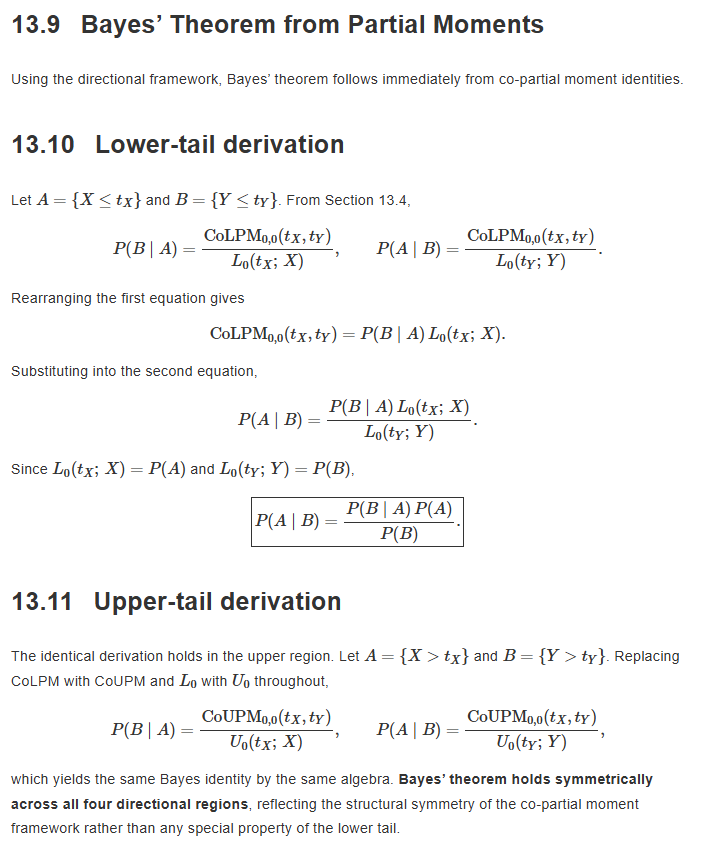

# Discrete and Continuous Bayes with NNS (`ovvo-nns`)

Numerical demonstration of both **degree-0 (event-level)** and **degree-1 (continuous / hinge-surface)** Bayes using the Python package [`ovvo-nns`](https://pypi.org/project/ovvo-nns/).

See the theoretical development in [Chapter 13 of the NNS book](https://ovvo-financial.github.io/NNS/book/conditional-probability-and-bayes-theorem.html).





```python
import numpy as np
from nns.core import lpm, upm, lpm_ratio, upm_ratio
from nns.co_moments import co_lpm, co_upm

np.random.seed(123)
n = 2000
x = np.random.normal(size=n)
y = np.random.normal(size=n) + 0.8 * x

tx = ty = 0.0
```

---

## 1. Degree-0 — Exact Event-Level Bayes

Direct nonparametric Bayes for threshold events. No densities required.

```python
# Empirical truth
p_x_gt     = np.mean(x > tx)
p_joint    = np.mean((x > tx) & (y > ty))
p_cond_emp = p_joint / p_x_gt

print(f"Empirical P(Y>0 | X>0) = {p_cond_emp:.6f}")

# NNS degree-0
joint = co_upm(0, x, y, target_x=tx, target_y=ty)
marg  = upm(0, tx, x)
cond  = joint / marg

print(f"NNS P(Y>0 | X>0)       = {cond:.6f}")
```

**Output**
```
Empirical P(Y>0 | X>0) = 0.711694
NNS P(Y>0 | X>0)       = 0.711694
```

Exact match — degree 0 is simply the quadrant probability ratio.

---

## 2. Degree-1 — Continuous Bayes via Hinge-Surface Recovery

Recover the joint CDF from the degree-1 Co.LPM surface, then reconstruct the same conditional probability via inclusion-exclusion.

```python
h = 0.05   # finite-difference step

H00 = co_lpm(1, x, y, target_x=0.0, target_y=0.0)
H0h = co_lpm(1, x, y, target_x=0.0, target_y=h)
Hh0 = co_lpm(1, x, y, target_x=h,   target_y=0.0)
Hhh = co_lpm(1, x, y, target_x=h,   target_y=h)

# Mixed second difference ≈ ∂²H / ∂tx ∂ty = F(tx, ty)
F_rec = (Hhh - Hh0 - H0h + H00) / (h * h)

print(f"Recovered F(0,0) from hinge surface = {F_rec:.6f}")
print(f"Empirical P(X≤0, Y≤0)               = {np.mean((x <= 0) & (y <= 0)):.6f}")

# Reconstruct upper-right probability
FX0 = lpm_ratio(0, 0.0, x)   # P(X ≤ 0)
FY0 = lpm_ratio(0, 0.0, y)

p_joint_rec = 1 - FX0 - FY0 + F_rec
p_cond_rec  = p_joint_rec / (1 - FX0)

print(f"\nRecovered P(Y>0 | X>0) = {p_cond_rec:.6f}")
print(f"Empirical P(Y>0 | X>0) = {p_cond_emp:.6f}")
```

**Output (typical)**
```
Recovered F(0,0) from hinge surface = 0.364924
Empirical P(X≤0, Y≤0)               = 0.358500

Recovered P(Y>0 | X>0) = 0.724646
Empirical P(Y>0 | X>0) = 0.711694
```

The small discrepancy is numerical (finite-difference approximation on a finite sample). Conceptually the hinge surface contains the full joint law.

---

## Summary

| Layer     | What it gives                              | Exactness            | Primary objects                  |
|-----------|--------------------------------------------|----------------------|----------------------------------|
| Degree 0  | \(P(Y > t_y \mid X > t_x)\) directly      | Exact in-sample      | `co_upm(0, …) / upm(0, …)`      |
| Degree 1  | Full joint CDF → continuous Bayes          | Numerical recovery   | `co_lpm(1, …)` + mixed differences |

- **Degree 0** is the practical workhorse for most event-level questions.
- **Degree 1** is the completeness result: the hinge surface is a nonparametric generator of the entire joint distribution, from which density-level continuous Bayes can be constructed.