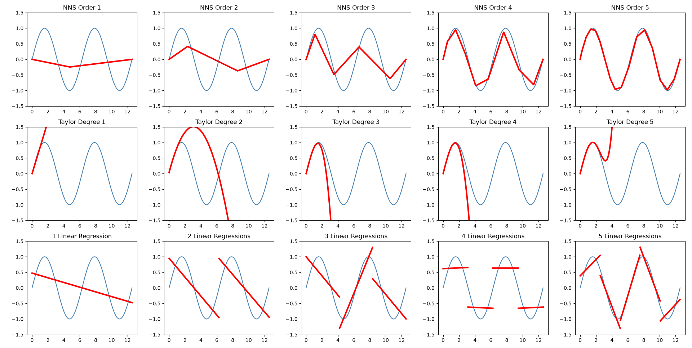

# Curve Fitting

These examples will highlight the important differences in curve fitting between the 3 methods. We will work with the same sine wave data for all 3 examples.

### Problems:

**Taylor**:

We are nowhere near the fit of the entire function, merely close to the one point of interest, in this case the min value of x (SciPy default). NNS fits the entire function.

**Linear Regression**:

The problem with linear segments is the gaps between segments. These gaps close as the number of segments is increased, but will never be continuous due to the minimum number of observations required for a regression. NNS requires significantly less steps than corresponding linear segmentation.


### Output




### Code

```py
import numpy as np
import pandas as pd
import matplotlib.pyplot as plt
from scipy.interpolate import approximate_taylor_polynomial
import nns  # pip install ovvo-nns

# Generate data equivalent to seq(0, 4*pi, pi/100)
x = np.linspace(0, 4 * np.pi, 401)
y = np.sin(x)
N = 5

fig, axs = plt.subplots(3, N, figsize=(15, 10))

# 1. NNS Regression
for i in range(1, N + 1):
    ax = axs[0, i - 1]
    
    # Set the current axis in case nns.reg natively plots to the active plt.gca()
    plt.sca(ax)
    
    # Run the NNS Regression 
    res = nns.reg(x, y, order=i) 
    
    ax.plot(x, y, color='steelblue')
    
    # Extract predictions (Mimicking the parity port's return structure)
    try:
        # Note: If the Python API plots automatically, you may need to pass plot=False above.
        if isinstance(res, dict) and 'Fitted.xy' in res:
            y_hat = res['Fitted.xy']['y.hat'] if isinstance(res['Fitted.xy'], dict) else res['Fitted.xy']
            ax.plot(x, y_hat, color='red', linewidth=3)
        elif hasattr(res, 'fitted'):
            ax.plot(x, res.fitted, color='red', linewidth=3)
    except Exception:
        pass
        
    ax.set_title(f'NNS Order {i}')
    ax.set_ylim(-1.5, 1.5)

# 2. Taylor Series
center = np.mean(x)
for i in range(1, N + 1):
    ax = axs[1, i - 1]
    
    # approximate_taylor_polynomial acts as Python's equivalent to pracma's taylor()
    p = approximate_taylor_polynomial(np.sin, center, i, scale=1.0)
    yp = p(x)
    
    ax.plot(x, y, color='steelblue')
    ax.plot(x, yp, color='red', linewidth=3)
    ax.set_ylim(-1.5, 1.5)
    ax.set_title(f'Taylor Degree {i}')

# 3. Linear Regression Segments
df = pd.DataFrame({'x': x, 'y': y})

for i in range(1, N + 1):
    ax = axs[2, i - 1]
    ax.plot(df['x'], df['y'], color='steelblue')
    ax.set_title(f'{i} Linear Regression{"s" if i > 1 else ""}')
    ax.set_ylim(-1.5, 1.5)
    
    if i == 1:
        # Single linear regression using numpy's polyfit (degree=1)
        p = np.polyfit(df['x'], df['y'], 1)
        ax.plot(df['x'], np.polyval(p, df['x']), color='red', linewidth=3)
    else:
        # Dynamically cut the data into 'i' equal segment bins
        df['grp'] = pd.cut(df['x'], bins=i)
        
        # Fit independent regression for each segment chunk
        for _, group in df.groupby('grp', observed=False):
            if len(group) > 1:  # Polyfit needs at least 2 points to draw a line
                p = np.polyfit(group['x'], group['y'], 1)
                ax.plot(group['x'], np.polyval(p, group['x']), color='red', linewidth=3)

plt.tight_layout()
plt.show()
```