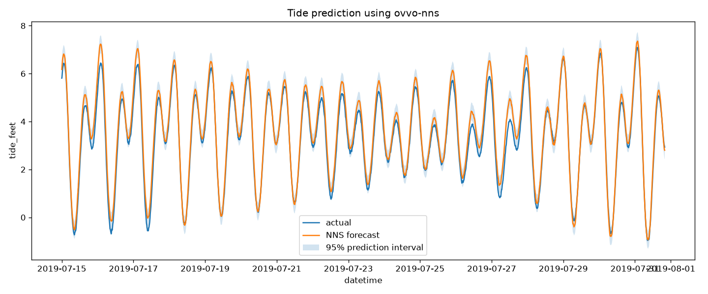

# Lord Kelvin, meet the data scientist 🌊

Tides were the original "hard" forecasting problem. In **1872, Lord Kelvin
(William Thomson)** built a brass [tide-predicting
machine](https://tidesandcurrents.noaa.gov/predmach.html) — a mechanical analog
computer that summed **10 astronomical harmonic constituents** (M2, S2, N2, K1,
O1, K2, L2, P1, M4, MS4) to trace a tide curve. Later machines summed **37**.
Every one of those constituents had to be *identified from the physics* of the
Earth–Moon–Sun system and tuned by hand for each port.

This example reproduces that forecast **from the raw water-level series alone** —
no astronomy, no named constituents, no hand-tuned periods. The
[`ovvo-nns`](https://pypi.org/project/ovvo-nns/) implementation of NNS.ARMA
discovers the seasonal structure empirically and forecasts a held-out two-week
window.

## Result



```
nns version: 1.0.6
selected periods: [46204 13166 45957 42597 45955]
method: lin
objective: 0.010669447504996599
R-squared: 0.9645500950621061
seasonality elapsed: 0.00 seconds
forecast elapsed:    137.14 seconds
total elapsed:       138.25 seconds
```

**R² ≈ 0.965** on a genuine out-of-sample fortnight — and notice the selected
periods are *not* the textbook ~12.4 h semidiurnal harmonic. NNS finds whatever
minimizes the validation objective; it rediscovers the tidal rhythm without
being told any of the physics Kelvin spent a career formalizing.

## Run it

```bash
pip install ovvo-nns pandas matplotlib
python tides_nns.py
```

Data: NOAA tide-gauge series via the
[OVVO-Financial/NNS](https://github.com/OVVO-Financial/NNS) repo. Runtime is
dominated by `NNS.ARMA.optim` (~2 min); seasonality detection is near-instant.

## A note on the one non-obvious line

```python
nns_periods = all_periods[all_periods < training_set // 4][:100]
```

`nns_seas` returns *every* candidate period, sorted strongest-first. For a long
series the strongest periods are very large, and `NNS.ARMA.optim` only accepts
periods short enough to fit ~3–4 full cycles in the training window
(`period < training_set / denominator`). So filter **before** you slice —
otherwise the top-100 can be entirely oversized and the optimizer rejects them.

## Full script

Copy-paste this to replicate directly — it's the same as
[`tides_nns.py`](tides_nns.py).

<details>
<summary><code>tides_nns.py</code></summary>

```python
"""Lord Kelvin, meet the data scientist: tide forecasting with ovvo-nns.

Tides were the original "hard" forecasting problem. In 1872 Lord Kelvin built a
brass tide-predicting machine that mechanically summed 10 astronomical harmonic
constituents (M2, S2, N2, K1, O1, ...); later machines summed 37. Each constituent
had to be identified from the physics of the Earth-Moon-Sun system.

This script reproduces that forecast from the raw water-level series alone -- no
astronomy, no named constituents, no hand-tuned periods. NNS.ARMA discovers the
seasonal structure empirically and forecasts a held-out two-week window.

Runtime is dominated by NNS.ARMA.optim (~2 min); seasonality detection is instant.
"""

from time import perf_counter

import matplotlib.pyplot as plt
import numpy as np
import pandas as pd

import nns

total_start = perf_counter()
print("nns version:", nns.__version__)

url = (
    "https://raw.githubusercontent.com/OVVO-Financial/NNS/"
    "Data-and-Simulation-Routines/Datasets/tides_csv.csv"
)
tides = pd.read_csv(url)
tides["dt"] = pd.to_datetime(tides["dt"], utc=True)

cut_date_time = pd.Timestamp("2019-07-15 00:00:00", tz="UTC")
dtrain = tides.loc[tides["dt"] < cut_date_time].copy()
dtest = tides.loc[tides["dt"] >= cut_date_time].copy()

y_train = dtrain["tide_feet"].to_numpy(dtype=np.float64)
y_test = dtest["tide_feet"].to_numpy(dtype=np.float64)

# Validate on a window equal to the forecast horizon.
training_set = len(y_train) - len(y_test)

# nns_seas returns every candidate period, sorted by coefficient of variance
# (strongest first). For long series the strongest periods are very large, so
# shortlist only the periods NNS.ARMA.optim can actually use -- it requires
# period < training_set / denominator (3-4 full cycles). Filter BEFORE slicing,
# otherwise the top-N may be entirely oversized and optim will reject them.
seasonality_start = perf_counter()
seasonality = nns.nns_seas(y_train)
seasonality_stop = perf_counter()

all_periods = np.asarray(seasonality["periods"], dtype=np.int64)
max_usable_period = training_set // 4  # conservative; matches optim's limit here
nns_periods = all_periods[all_periods < max_usable_period][:100]

if nns_periods.size == 0:
    raise RuntimeError(f"No usable seasonal periods below {max_usable_period}.")

forecast_start = perf_counter()
arma_parameters = nns.nns_arma_optim(
    y_train,
    h=len(y_test),
    training_set=training_set,
    pred_int=0.95,
    seasonal_factor=nns_periods,
    lin_only=True,
    print_trace=False,
)
forecast_stop = perf_counter()

nns_estimates = np.asarray(arma_parameters["results"], dtype=np.float64)
lower_pi = np.asarray(arma_parameters["lower.pred.int"], dtype=np.float64)
upper_pi = np.asarray(arma_parameters["upper.pred.int"], dtype=np.float64)

ss_res = np.sum((y_test - nns_estimates) ** 2)
ss_tot = np.sum((y_test - np.mean(y_test)) ** 2)
r_squared = 1.0 - ss_res / ss_tot
total_stop = perf_counter()

# Note: the selected periods are large and not the "textbook" ~12.4 h tidal
# harmonic -- NNS picks whatever minimizes the validation objective.
print("selected periods:", arma_parameters["periods"])
print("method:", arma_parameters["method"])
print("objective:", arma_parameters["obj.fn"])
print("R-squared:", r_squared)
print(f"seasonality elapsed: {seasonality_stop - seasonality_start:,.2f} seconds")
print(f"forecast elapsed:    {forecast_stop - forecast_start:,.2f} seconds")
print(f"total elapsed:       {total_stop - total_start:,.2f} seconds")

plt.figure(figsize=(12, 5))
plt.plot(dtest["dt"], y_test, label="actual")
plt.plot(dtest["dt"], nns_estimates, label="NNS forecast")
plt.fill_between(dtest["dt"], lower_pi, upper_pi, alpha=0.2, label="95% prediction interval")
plt.title("Tide prediction using ovvo-nns")
plt.xlabel("datetime")
plt.ylabel("tide_feet")
plt.legend()
plt.tight_layout()
plt.savefig("tides_forecast.png", dpi=120)  # so the README can show the figure
plt.show()
```

</details>

---

Inspired by John Mount's
[*Lord Kelvin, Data Scientist*](https://win-vector.com/2019/08/06/lord-kelvin-data-scientist/)
(Win-Vector).
