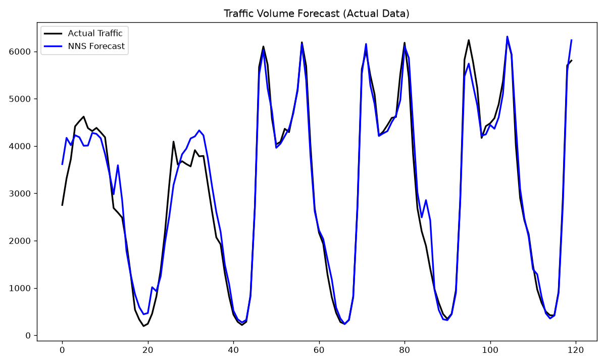

# N-HiTS is a neural breakthrough — NNS needs no network 🚦

[N-HiTS](https://arxiv.org/abs/2201.12886) (Neural Hierarchical Interpolation for
Time Series, AAAI 2023) is one of the strongest deep-learning forecasters around.
By combining **multi-rate input sampling** with **hierarchical interpolation** —
built on the N-BEATS lineage — it reports roughly **20% better long-horizon
accuracy than Transformer models at ~50× less compute**. It is, however, still a
neural network: it needs a training loop, hyperparameters, and the hardware to go
with them.

Marco Peixeiro's walkthrough, [*All About
N-HiTS*](https://www.datasciencewithmarco.com/blog/all-about-n-hits-the-latest-breakthrough-in-time-series-forecasting),
applies N-HiTS to exactly this problem: forecast the last **120 steps** (five
days) of the hourly **Interstate 94 Westbound** traffic-volume series, scored by
MAE. This example runs the *same* dataset, the *same* `[:-120]` / `[-120:]`
split, and the *same* metric — but with `NNS.ARMA` instead of a neural network:
**no training loop, no hyperparameter search**, seasonal periods discovered
directly from the data by `nns_seas`.

## Result



```
MAE on traffic data: 236.16791666666677
```

Head-to-head on the identical series, split, and metric (deep-learning numbers
from the article):

| Model | MAE | Beats the naive baseline? |
|-------|----:|:--:|
| **NNS.ARMA.optim** | **236** | ✅ |
| Naive seasonal (weekly, K=168) | 249 | — |
| N-HiTS | 266 | ❌ |
| N-BEATS | worse than N-HiTS | ❌ |

The article's punchline is that **neither N-HiTS nor N-BEATS beats the simple
naive seasonal baseline** on this series ("the baseline still outperforms
N-HiTS"). NNS is the only method here that does — an MAE of **236** versus the
baseline's 249 and N-HiTS's 266 — and it gets there in seconds with none of the
training machinery a neural model needs. (In fairness, the article notes this is
a small, repetitive sample, which is partly why the baseline is so strong; the
point is that NNS clears a bar the neural models did not.)

## Run it

```bash
pip install ovvo-nns pandas numpy scikit-learn matplotlib
python nhits_traffic.py
```

Writes `nhits_traffic_forecast.png` next to the script. Data is the hourly
traffic-volume series from the
[OVVO-Financial/NNS](https://github.com/OVVO-Financial/NNS) repo.

## How it works

```python
seas_result = NNS.nns_seas(train_set, plot=False)
periods = seas_result.get("periods", [])

nns_estimates = NNS.nns_arma_optim(
    variable=train_set,
    h=120,
    seasonal_factor=periods,
    obj_fn=lambda predicted, actual: np.mean(np.abs(predicted - actual)),
    objective="min",
    negative_values=False,
)
```

`nns_seas` finds the candidate seasonal periods; `nns_arma_optim` cross-validates
combinations of them and forecasts `h=120` steps ahead. The `obj_fn` is set to
MAE so the optimizer targets the same metric the benchmark reports. (`nns_arma_optim`
silently discards any periods too long to estimate, so the full `nns_seas` list can
be passed straight in.)

---

N-HiTS background from Marco Peixeiro's
[*All About N-HiTS*](https://www.datasciencewithmarco.com/blog/all-about-n-hits-the-latest-breakthrough-in-time-series-forecasting)
and the [original paper](https://arxiv.org/abs/2201.12886) (Challu, Olivares, et al.).
