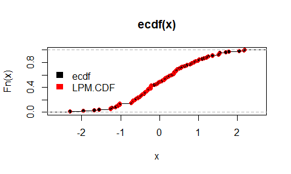

# Distribution Theory from Partial Moments

Chapter 2 introduced directional deviation operators and the partial moments constructed from them.  
Those operators separate deviations relative to a benchmark into directional components.

This chapter establishes a surprising result:

**the cumulative distribution function is itself a partial moment.**

Once this relationship is recognized, several foundational objects of probability theory—survival functions, hazard rates, and quantile functions—emerge naturally from the same framework.

---

## Degree-Zero Partial Moments

Recall the definitions of the lower and upper partial moments.

For integer \( r \ge 0 \),

\[
L_r(t;X) = E[(t-X)_+^r]
\]

\[
U_r(t;X) = E[(X-t)_+^r].
\]

When \( r = 0 \), we interpret the expressions directly in indicator form:

\[
(t-X)_+^0 =
\begin{cases}
1 & X \le t \\
0 & X > t
\end{cases}
\]

\[
(X-t)_+^0 =
\begin{cases}
1 & X > t \\
0 & X \le t
\end{cases}
\]

Thus the degree-zero lower partial moment becomes

\[
L_0(t;X) = E[(t-X)_+^0].
\]

Observe that the expression \((t-X)_+^0\) behaves exactly like an indicator function, which is the intended degree-zero convention used throughout this chapter.

Thus

\[
(t-X)_+^0 = 1_{\{X \le t\}}.
\]

Taking expectations yields the following fundamental result.

---

### Theorem 3.1 (CDF Representation)

For any random variable \(X\) and benchmark \(t \in \mathbb{R}\),

\[
L_0(t;X) = P(X \le t) = F_X(t).
\]

**Proof**

From the definition of the lower partial moment,

\[
L_0(t;X) = E[(t-X)_+^0].
\]

As shown above,

\[
(t-X)_+^0 = 1_{\{X \le t\}}.
\]

Therefore

\[
L_0(t;X) = E[1_{\{X \le t\}}].
\]

Since the expectation of an indicator equals the probability of the event,

\[
L_0(t;X) = P(X \le t).
\]

Thus

\[
L_0(t;X) = F_X(t).
\]

\(\square\)

**Remark.**  
The cumulative distribution function is therefore not an independent primitive of probability theory. It is the degree-zero instance of the partial-moment operator.

### Empirical CDF Equivalence in R

The degree-zero lower partial moment can be computed directly and compared to the empirical CDF:

```r
library(NNS)
P = ecdf(x)
P(0) ; P(1)
LPM(degree = 0, target = 0, variable = x) ; LPM(degree = 0, target = 1, variable = x)

# Vectorized targets:
LPM(degree = 0, target = c(0, 1), variable = x)

plot(ecdf(x))
points(sort(x), LPM(degree = 0, target = sort(x), variable = x), col = "red")
legend("left", legend = c("ecdf", "LPM.CDF"), fill = c("black", "red"), border = NA, bty = "n")
```

<center>

</center>

---

## Complementary Directional Probability

Theorem 3.1 showed that the cumulative distribution function is the degree-zero lower partial moment:

\[
F_X(t) = L_0(t;X).
\]

The complementary directional probability is given by the **upper degree-zero partial moment**

\[
U_0(t;X) = P(X > t).
\]

These two quantities partition the sample space, so

\[
L_0(t;X) + U_0(t;X) = 1.
\]

Equivalently,

\[
F_X(t) + U_0(t;X) = 1.
\]

Thus the directional operators provide a natural decomposition of probability mass relative to the benchmark \(t\):

- \(L_0(t;X)\): probability mass **at or below the benchmark**
- \(U_0(t;X)\): probability mass **above the benchmark**

This directional partition forms the foundation for the survival and hazard functions examined in the next sections.

---

## The Survival Function

The **survival function** is defined as

\[
S_X(t) = P(X > t).
\]

Using the directional framework,

\[
S_X(t) = U_0(t;X).
\]

Thus the survival function is simply the **upper degree-zero partial moment**.

Because

\[
F_X(t) + S_X(t) = 1,
\]

the CDF and survival function represent complementary directional probabilities.

This interpretation is particularly useful in reliability analysis, survival analysis, and risk management, where interest often lies in the probability that outcomes exceed a threshold.

---

## Hazard Rates

In survival analysis the **hazard rate** describes the instantaneous probability of failure conditional on survival.

For continuous distributions the hazard rate is defined as

\[
h(t) = \frac{f(t)}{S_X(t)}
\]

where \(f(t)\) is the probability density function.

The density function can be written as the derivative of the cumulative distribution function:

\[
f(t) = \frac{d}{dt}F_X(t).
\]

Since

\[
F_X(t) = L_0(t;X),
\]

this implies

\[
f(t) = \frac{d}{dt}L_0(t;X).
\]

Thus the hazard rate becomes

\[
h(t) = \frac{f(t)}{U_0(t;X)}.
\]

This provides a directional interpretation of the hazard rate.

The upper partial moment \(U_0(t;X)\) represents the probability mass that remains **above the benchmark \(t\)**.  
The hazard rate therefore measures the instantaneous **flow of probability mass across the benchmark** from the upper directional region \(X > t\) into the lower region \(X \le t\).

The **cumulative hazard function** is

\[
H(t) = \int_0^t h(s)\,ds.
\]

Although hazard rates are typically introduced within survival analysis, they arise naturally within the directional framework once the survival function is recognized as an upper partial moment.

---

## Quantile Functions

The **quantile function** provides the inverse mapping of the cumulative distribution function.

For \( p \in (0,1) \), the quantile is defined as

\[
Q(p) = \inf\{x : F_X(x) \ge p\}.
\]

Because

\[
F_X(t) = L_0(t;X),
\]

the quantile function identifies the benchmark \(t\) at which the degree-zero partial moment reaches probability level \(p\).

Quantiles therefore correspond to **benchmarks that partition probability mass**.

This interpretation aligns naturally with the directional framework, which evaluates distributions relative to benchmark thresholds.


### Lower-Tail Thresholds as Degree-Zero Partial-Moment Quantiles

A lower-tail threshold is often introduced in application-specific language, but within the directional framework it is simply a quantile of the degree-zero lower partial moment.

Let
\[
F_X(t)=P(X\le t).
\]
By the result established earlier in this chapter,
\[
F_X(t)=L_0(t;X).
\]
Therefore the lower-tail quantile at probability level \(\alpha\) may be written as
\[
Q_X(\alpha)=\inf\{t\in\mathbb{R}:F_X(t)\ge \alpha\}
=\inf\{t\in\mathbb{R}:L_0(t;X)\ge \alpha\}.
\]

This identity is general. It does not depend on whether \(X\) represents returns, forecast errors, waiting times, deviations from a quality target, or distances below a safety threshold. In every case, the degree-zero lower partial moment answers the same question: what proportion of observations fall below the benchmark \(t\)?

In some fields, especially finance, the lower-tail quantile
\[
\inf\{t:F_X(t)\ge \alpha\}
\]
is called Value-at-Risk. But the mathematical object is broader than that label. It is the benchmark value that partitions a chosen fraction \(\alpha\) of lower-tail mass.

This observation matters because it shows that threshold analysis is not an external application added onto the theory of distributions. It is already contained in the degree-zero directional representation of probability. The estimation-error literature makes the same point explicitly by identifying \(LPM_0\) with the cumulative distribution function and hence with the probability-of-loss object used in applied risk work.

A second implication will become important later. Degree zero partitions observations by frequency alone. Higher degrees retain the same threshold logic while reweighting observations by the severity of their deviations from the benchmark. Thus quantile thinking extends naturally from event frequency to severity-weighted directional mass.

**Proposition 3.1A.** For any random variable \(X\) and any \(\alpha\in(0,1)\),

\[
Q_X(\alpha)=\inf\{t:L_0(t;X)\ge \alpha\}.
\]

**Proof.** Since \(L_0(t;X)=F_X(t)\), the result follows directly from the definition of the lower quantile.


---

## Probability Integral Transform

If \(X\) has cumulative distribution function \(F_X\), then the transformed variable

\[
U = F_X(X)
\]

is uniformly distributed on \([0,1]\).

Since

\[
F_X(t) = L_0(t;X),
\]

the probability integral transform can be written in directional form as

\[
U = L_0(X;X).
\]

Here the benchmark equals the realized observation. The operator therefore measures the probability that an **independent draw from the same distribution** does not exceed the observed value.

The transformation maps observations into probability space and forms the foundation for many statistical procedures including simulation, copula modeling, and dependence analysis.

---

## Distribution Theory as Directional Measurement

Classical probability theory typically introduces the cumulative distribution function as a primitive object.

The directional framework reveals that the CDF arises from a simpler structure.

It is simply the **degree-zero instance of the partial-moment operator**.

Higher-order partial moments measure magnitudes of directional deviation, while the degree-zero case measures directional probability mass.

Thus probability distribution functions and moment statistics emerge from the same underlying primitive.

---

## Structural Implications

The results of this chapter establish three key points.

1. The cumulative distribution function is the degree-zero lower partial moment.

2. The survival function is the degree-zero upper partial moment.

3. Quantile functions identify benchmarks that partition probability mass.

Distribution theory therefore lies inside the same directional framework that generates moment statistics.

The next chapter turns to **numerical integration via partial moments**. Chapter 5 then shows how **classical moments arise as signed combinations of partial moments**, further demonstrating the unifying role of directional statistics.
