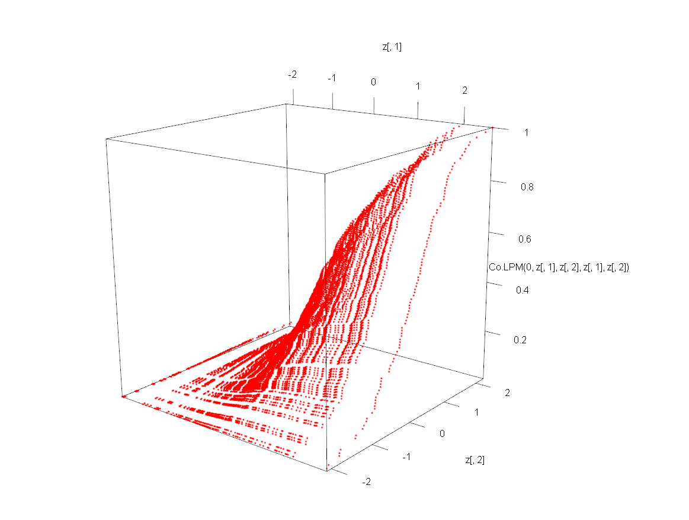

# Copula Interpretation

Chapters 9 and 10 showed that classical dependence measures such as covariance and correlation arise from **aggregations of directional co-partial moments**. Directional statistics preserves the structure of joint deviations by separating contributions across regions of the joint distribution rather than collapsing them into a single summary statistic.

Another widely used framework for describing dependence is **copula theory**, which represents dependence by transforming variables into probability space and isolating the joint structure from the marginal distributions.

This chapter shows that the directional framework connects naturally to copula theory. In particular, directional co-partial moments can be interpreted as **magnitude-weighted dependence measures within copula space**.

---

## Copula Fundamentals

Let \(X\) and \(Y\) be continuous random variables with cumulative distribution functions

\[
F_X(x), \qquad F_Y(y).
\]

Define the probability transforms

\[
U = F_X(X), \qquad V = F_Y(Y).
\]

By the probability integral transform,

\[
U, V \sim \text{Uniform}(0,1).
\]

This result holds when \(X\) and \(Y\) are continuous random variables. For discrete or mixed distributions the probability integral transform requires minor adjustments, but the continuous case suffices for the conceptual development here.

The joint distribution of \((U,V)\) is called the **copula** of \((X,Y)\):

\[
C(u,v) = P(U \le u, V \le v).
\]

Sklar’s theorem states that any joint distribution can be written

\[
F_{X,Y}(x,y)
=
C(F_X(x),F_Y(y)).
\]

Thus the copula isolates the **dependence structure independently of the marginal distributions**.

---

## Directional Statistics and Probability Space

The directional framework provides a natural interpretation of this transformation.

From earlier chapters, the cumulative distribution function equals the degree-zero lower partial moment:

\[
F_X(t) = L_0(t;X).
\]

Thus the copula transformation

\[
U = F_X(X)
\]

can be written

\[
U = L_0(X;X).
\]

In other words, copula coordinates arise directly from **directional probability transforms**.

Each observation is mapped into probability space according to its position within the cumulative distribution.

---

## Directional Regions in Copula Space

Once transformed, the joint distribution lies in the unit square

\[
[0,1]^2.
\]

Benchmarks partition this square into directional regions.

For probability thresholds \(u_t\) and \(v_t\),

| | \(V \le v_t\) | \(V > v_t\) |
|---|---|---|
| \(U \le u_t\) | joint lower region | divergent region |
| \(U > u_t\) | divergent region | joint upper region |

These correspond directly to the four directional regions defined earlier:

- **CoLPM region:** both variables below benchmark  
- **CoUPM region:** both variables above benchmark  
- **DLPM region:** \(X\) above benchmark, \(Y\) below  
- **DUPM region:** \(X\) below benchmark, \(Y\) above  

Thus the directional framework partitions the copula domain in the same way that co-partial moments partition the original joint distribution.

---

## Co-Partial Moments as Weighted Copula Regions

Directional co-partial moments measure deviations within these regions.

For benchmarks \(t_X\) and \(t_Y\),

\[
CoLPM_{r,s}(X,Y)
=
E[(t_X-X)_+^r (t_Y-Y)_+^s].
\]

The corresponding copula probability is

\[
P(X \le t_X, Y \le t_Y)
=
C(F_X(t_X),F_Y(t_Y)).
\]

Equivalently,

\[
CoLPM_{0,0}(t_X,t_Y)
=
C(F_X(t_X),F_Y(t_Y)).
\]

Thus

- copulas measure **probability of directional regions**, while  
- co-partial moments measure **magnitude of deviations within those regions**.

Higher orders \(r,s\) increase sensitivity to extreme observations, producing a continuous generalization of tail dependence.

---

## Copula Representation of Co-Partial Moments

Directional co-partial moments admit a direct representation in copula space.

**Theorem 11.1 (Copula Representation of Co-Partial Moments)**  

Let \(X\) and \(Y\) be continuous random variables with copula \(C(u,v)\) and quantile functions \(Q_X(u)\), \(Q_Y(v)\). Here

\[
Q_X(u)=F_X^{-1}(u), \qquad Q_Y(v)=F_Y^{-1}(v)
\]

denote the marginal quantile functions.

Then the co-lower partial moment can be written

\[
CoLPM_{r,s}(X,Y)
=
\int_0^1
\int_0^1
(t_X - Q_X(u))_+^r
(t_Y - Q_Y(v))_+^s
\, dC(u,v).
\]

**Proof.**

By Sklar’s theorem,

\[
(X,Y) =
(Q_X(U), Q_Y(V))
\]

where \((U,V)\) follows the copula \(C\).

Substituting into the definition of the co-lower partial moment gives

\[
E[(t_X-Q_X(U))_+^r (t_Y-Q_Y(V))_+^s].
\]

Expressing the expectation with respect to the copula distribution yields the result. ∎

This representation shows that copulas describe **probability mass over directional regions**, while co-partial moments additionally weight observations by their **deviation magnitudes**.

---

## Example: Directional Dependence Surface and Copula Transformation

The following illustration uses functions from the **NNS R package** introduced earlier. In particular, `Co.LPM()` computes co-lower partial moments and `LPM.ratio()` produces the probability transform used for directional ranking.

Generate correlated Gaussian observations:

```r
library(MASS)

set.seed(123)

Sigma <- matrix(c(1,0.7,0.7,1),2,2)
xy <- mvrnorm(100,c(0,0),Sigma)

x <- xy[,1]
y <- xy[,2]

z <- expand.grid(x,y)
```

Plot the **Co-Lower Partial Moment surface** relative to benchmark \(t_X=t_Y=0\):

```r
rgl::plot3d(
  z[,1],
  z[,2],
  Co.LPM(0,z[,1],z[,2],z[,1],z[,2]),
  col="red"
)
```

<center>

</center>

In the call `Co.LPM(0, z[,1], z[,2], z[,1], z[,2])`, the argument order is `(degree, x, y, target.x, target.y)`. Setting `degree = 0` produces the probability-level co-lower partial moment, and reusing `z[,1]`/`z[,2]` as both variables and targets evaluates the surface over the full grid of benchmark pairs. The visualization uses `rgl::plot3d`, which produces an interactive three-dimensional plot.

This surface represents the magnitude of **joint downside deviations** in the original variable space.

Next transform the variables into probability space:

```r
u_x <- LPM.ratio(0,x,x)
u_y <- LPM.ratio(0,y,y)

z <- expand.grid(u_x,u_y)
```

Plotting the same directional statistic in probability space gives

```r
rgl::plot3d(
  z[,1],
  z[,2],
  Co.LPM(0,z[,1],z[,2],z[,1],z[,2]),
  col="blue"
)
```

<center>
![Figure 11.2. Co-LPM surface in copula/probability space \([0,1]^2\) (blue), showing the same dependence geometry after marginal probability transformation.](images/ch11_transformed_copula.png)

</center>

The resulting surface lies within the unit square \([0,1]^2\), which represents the **copula domain**.

The transformation

\[
(X,Y) \rightarrow (F_X(X),F_Y(Y))
\]

changes the coordinate system but preserves the dependence structure.

For a direct multivariate dependence summary in the package, `NNS.copula()` can be called on a matrix of variables:

```r
set.seed(123)
z3 <- rnorm(length(x))

NNS.copula(cbind(x, y, z3), plot = TRUE, independence.overlay = TRUE)
## [1] 0.302
```

The return value is a single scalar in \([0,1]\) for the full multivariate system, where values closer to 0 indicate near-independence and values closer to 1 indicate stronger joint dependence. When needed, `continuous = TRUE` can be supplied to align with the continuous-CDF formulation used elsewhere in the package vignettes.

---

## Tail Dependence and Directional Moments

Copula theory frequently focuses on **tail dependence**, which measures the probability that variables experience extreme outcomes simultaneously.

Upper tail dependence is defined as

\[
\lambda_U
=
\lim_{u\to1^-}
P(V>u \mid U>u)
\]

and lower tail dependence as

\[
\lambda_L
=
\lim_{u\to0^+}
P(V\le u \mid U\le u).
\]

These limits exist for many commonly used copula families. In some cases, such as the Gaussian copula, both coefficients equal zero even when correlation is strong.

Directional statistics provides a natural extension of this concept.

Let

\[
t_X = Q_X(u), \qquad
t_Y = Q_Y(u)
\]

denote quantile thresholds approaching the lower tail.

The degree-zero co-partial moment is

\[
CoLPM_{0,0}(t_X,t_Y)
=
P(X\le t_X, Y\le t_Y).
\]

Then

\[
\frac{CoLPM_{0,0}(t_X,t_Y)}{P(X\le t_X)}
=
P(Y\le t_Y \mid X\le t_X).
\]

As \(u\to0\), this conditional probability converges to the copula lower tail dependence coefficient

\[
\lambda_L.
\]

This follows directly from the definition of tail dependence as the limit of conditional copula probabilities.

Higher-order directional moments generalize this concept by weighting deviations within the tail region.

---

## Comparison with Classical Copula Models

Copula analysis often relies on parametric families such as

- Gaussian copulas  
- Clayton copulas  
- Gumbel copulas  
- Student-t copulas.

These models impose specific functional forms on the dependence structure.

Directional dependence differs in several important ways.

### Nonparametric Structure

Co-partial moments are estimated directly from the data and do not require specifying a copula family.

### Sensitivity to Extreme Deviations

Many classical copulas capture **tail coincidence probabilities** but ignore the magnitude of extreme events. For example, the Gaussian copula has zero tail dependence unless correlation is exactly one, a property that has surprised many practitioners.

Directional moments avoid this limitation by measuring **deviation magnitude within tail regions**.

### Benchmark Flexibility

Copula analysis typically evaluates dependence at probability thresholds. Directional statistics instead allows benchmarks to be specified directly in the variable space.

---

## Multivariate Extension

Copula theory extends naturally to higher dimensions.

For variables

\[
X_1,\dots,X_d
\]

the joint distribution can be written

\[
F(x_1,\dots,x_d)
=
C(F_1(x_1),\dots,F_d(x_d)).
\]

Directional statistics extends similarly.

Benchmarks \(t_1,\dots,t_d\) partition the sample space into directional regions across all variables. Each variable contributes two directional states (above or below its benchmark), producing \(2^d\) joint regions.

Multivariate co-partial moments measure deviations within these regions. For example,

\[
E[(t_1-X_1)_+(t_2-X_2)_+(t_3-X_3)_+]
\]

captures joint downside deviations across three variables.

In practice analysts often focus on specific regions of interest—such as the region where all variables fall below their benchmarks—rather than enumerating all \(2^d\) regions explicitly.

---

## Structural Interpretation

Copulas separate **marginal distributions** from **dependence structure**.

Directional statistics provides a complementary perspective:

- Marginal distributions arise from **degree-zero partial moments**.
- Dependence arises from **co-partial moments across directional regions**.

Thus both frameworks describe the same joint structure from different viewpoints.

Copulas emphasize **rank-based probability structure**, while directional moments emphasize **benchmark-relative deviations**.

---

## Summary

This chapter connected directional dependence with copula theory.

Key observations include:

1. Copulas represent dependence in probability space.
2. Probability transforms map observations into the unit square.
3. Directional benchmarks partition copula space into four dependence regions.
4. Degree-zero co-partial moments correspond to copula region probabilities.
5. Higher-order co-partial moments generalize tail dependence by weighting extreme deviations.
6. Directional methods provide a nonparametric and magnitude-sensitive interpretation of copula dependence.

Directional partial moments therefore offer a natural bridge between benchmark-based statistics and rank-based dependence analysis.

The next chapter develops conditional probability and Bayes' theorem from the partial-moment framework.
