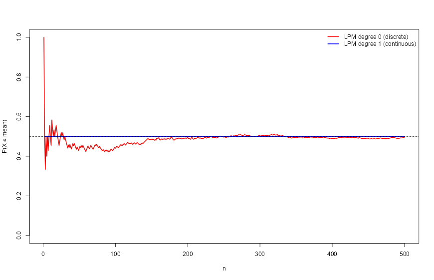

# Distribution Comparison

Previous chapters developed the directional framework for describing distributions, dependence, and conditional probability. Distribution estimation in Chapter 8 showed how empirical partial moments provide nonparametric estimates of entire distributions, while Chapters 9–13 demonstrated how directional moments reveal dependence, conditional probability, and causal structure.

A natural next question is how to **compare distributions**.

Classical statistics typically approaches this problem through **hypothesis testing**. Tests such as the Kolmogorov–Smirnov test, the Mann–Whitney test, or parametric t-tests attempt to determine whether two samples arise from the same underlying distribution.

While useful, these procedures emphasize **binary decisions**—reject or fail to reject a null hypothesis—rather than describing how distributions actually differ.

The directional framework approaches distribution comparison differently. Because partial moments characterize probability mass relative to benchmarks, two distributions can be compared directly through their **directional probability structure**.

This chapter develops a nonparametric approach to distribution comparison based on directional probability measures and effect-size interpretations rather than hypothesis-testing decisions. It then introduces the NNS ANOVA procedure, which operationalizes these ideas through the LPM-based continuous CDF, adds **stochastic superiority** as the fundamental pairwise effect-size comparison, and concludes with stochastic dominance tests that extend the comparison to ordered preference relations.

---

This chapter is organized into four signposted blocks so readers can move from concepts to implementation: **Block I (Theory)** develops comparison logic and the continuous-CDF correction; **Block II (Estimation mechanics)** defines operational estimators including stochastic superiority and NNS ANOVA; **Block III (Diagnostics)** covers dominance curves and ordered-comparison diagnostics; **Block IV (Applied workflow)** provides examples and practical guidance.

## Block I — Theory and foundational comparisons

### Classical Hypothesis Testing

In classical statistics, comparing two distributions usually begins with a **null hypothesis**

$$
H_0: F_X(t) = F_Y(t) \quad \text{for all } t.
$$

The alternative hypothesis states that the two distributions differ.

Several classical tests address this problem.

### Kolmogorov–Smirnov Test

The Kolmogorov–Smirnov statistic compares the empirical distribution functions

$$
D = \sup_t |\hat F_X(t) - \hat F_Y(t)|.
$$

Large values of $D$ indicate that the distributions differ.

### Mann–Whitney Test

The Mann–Whitney test evaluates whether observations from one sample tend to be larger than those from another sample.

### Parametric Tests

When parametric assumptions are imposed, tests such as the t-test compare population means.

Although widely used, these methods possess several limitations.

**Binary interpretation.**  
Hypothesis tests produce accept–reject decisions rather than quantitative descriptions of differences.

**Sample-size dependence.**  
With large samples, even trivial differences become statistically significant.

**Model dependence.**  
Parametric tests require assumptions about distributional form.

**Limited directional insight.**  
Most classical tests provide little information about how distributions differ across regions of the support.

The directional framework emphasizes **probability comparisons and effect sizes** instead.

---

### Nonparametric Distribution Comparison

Let $X$ and $Y$ be two random variables with distributions $F_X$ and $F_Y$.

A natural way to compare the distributions is to examine the probability that an observation from one distribution exceeds an observation from the other.

Define independent draws

$$
X' \sim F_X, \qquad Y' \sim F_Y.
$$

Consider the probability

$$
P(X' > Y').
$$

This quantity measures how frequently values from distribution $X$ exceed values from distribution $Y$.

Similarly,

$$
P(Y' > X')
$$

measures the opposite directional comparison.

Because

$$
P(X' > Y') + P(Y' > X') + P(X'=Y') = 1,
$$

these probabilities provide a complete comparison of the two distributions.

For continuous distributions, ties occur with probability zero, so

$$
P(X' > Y') + P(Y' > X') = 1.
$$

For discrete distributions, ties occur with positive probability. In this case, use the tie-adjusted directional probability

$$
p^* = P(X' > Y') + \tfrac{1}{2}P(X' = Y').
$$

This preserves symmetry and keeps the directional comparison centered at $0.5$ when the two distributions are indistinguishable.

This simple probability comparison already provides more information than a binary hypothesis test: it directly measures **which distribution tends to produce larger outcomes**.

---

### Directional Probability and Effect Size

The directional probability

$$
p = P(X' > Y')
$$

has a natural interpretation as an **effect-size measure**.

- $p = 0.5$ indicates that the two distributions are indistinguishable.
- $p > 0.5$ indicates that $X$ tends to produce larger values.
- $p < 0.5$ indicates that $Y$ tends to produce larger values.

Unlike hypothesis testing, this directional probability does not depend on arbitrary significance thresholds and remains directly interpretable as a frequency statement. If one reports the symmetric certainty transform $C = |2p - 1|$, then $C = 0$ (not $1$) corresponds to indistinguishable distributions, while $C = 1$ indicates complete separation.

---

### Directional Probability Comparisons

Directional probability comparisons can be extended using partial moments.

Let $t$ be a benchmark. The probability that $X$ exceeds the benchmark while $Y$ does not is

$$
P(X > t,\, Y \le t).
$$

Similarly,

$$
P(Y > t,\, X \le t)
$$

measures the opposite directional region.

Within the partial-moment framework, these probabilities correspond to **degree-zero divergent co-partial moments**:

$$
DUPM_{0,0}(t,t) = P(X > t,\, Y \le t),
$$

$$
DLPM_{0,0}(t,t) = P(X \le t,\, Y > t).
$$

The difference

$$
\Delta(t) = DUPM_{0,0}(t,t) - DLPM_{0,0}(t,t)
$$

indicates which distribution dominates relative to the benchmark.

- If $\Delta(t) > 0$, distribution $X$ more frequently exceeds the benchmark.
- If $\Delta(t) < 0$, distribution $Y$ does.

By examining $\Delta(t)$ across a range of benchmarks, analysts obtain a **directional dominance curve** describing where one distribution exceeds the other.

---

### The Discrete–Continuous CDF Distinction and Bias Elimination

Before developing operational comparison procedures, it is essential to confront a source of **systematic bias** embedded in the standard empirical CDF that has significant consequences for distribution comparison.

#### The Empirical CDF as a Discrete Measure

The empirical cumulative distribution function is identical to the **degree-zero lower partial moment ratio**:

$$
\hat{F}_X(t) = L_0(t; X) = \frac{1}{n} \sum_{i=1}^n \mathbf{1}_{\{x_i \le t\}},
$$

where $\mathbf{1}_{\{\cdot\}}$ is the indicator function. This is a **discrete** probability measure: it assigns probability mass only at observed data points and is a step function everywhere else. Even with one million observations, it remains a step function — it is never truly continuous.

A direct consequence of this discreteness is systematic bias in probability estimation at the sample mean. For a symmetric distribution, exactly 50% of the population lies below the mean. Yet for any finite sample,

$$
\hat{F}_X(\bar{x}) = \frac{1}{n}\sum_{i=1}^n \mathbf{1}_{\{x_i \le \bar{x}\}} 
e 0.5
$$

in general, because the sample mean typically falls between two observed values. This quantity oscillates around 0.5 and only converges asymptotically — it will never equal 0.5 for any particular finite draw.

This is not a minor technicality. Any comparison procedure that evaluates a group's discrete CDF at a shared benchmark inherits this bias: the two CDFs will appear to differ even when the groups are identical, simply because of discretization noise.

#### The Degree-One Partial Moment as a Continuous Probability

The directional framework resolves this bias by replacing the discrete indicator with **area-based probability mass** using the degree-one lower partial moment ratio:

$$
F_1(t; X) = \frac{LPM_1(t, X)}{LPM_1(t, X) + UPM_1(t, X)},
$$

where

$$
LPM_1(t, X) = \frac{1}{n} \sum_{i=1}^n \max(0,\, t - x_i),
\qquad
UPM_1(t, X) = \frac{1}{n} \sum_{i=1}^n \max(0,\, x_i - t).
$$

Rather than counting the fraction of observations below $t$, this ratio measures the fraction of the **total area of deviations** that lies below $t$. It corresponds to the continuous PDF probability

$$
P(X \le t) = \frac{\int_{-\infty}^t f(x)\,dx}{\int_{-\infty}^\infty f(x)\,dx},
$$

capturing the area between discrete bins that the step-function CDF ignores. This is the essential connection to the derivative relationship $f(x) = dF(x)/dx$: the degree-one ratio encodes the continuous probability density information that the degree-zero CDF discards.

In NNS, this is computed via `LPM.ratio(degree = 1, target, variable)`.

#### The Mean-Target Property: Exact Bias Elimination

A fundamental property follows from the algebraic structure of the degree-one ratio.

**Theorem.** For any random variable $X$ with finite mean $\mu_X$, and for any sample $x_1, \dots, x_n$,

$$
F_1(\bar{x};\, X) = 0.5
$$

exactly, where $\bar{x} = \frac{1}{n}\sum_{i=1}^n x_i$ is the sample mean.

**Proof.** Observe that pointwise,

$$
(t - x_i)^+ - (x_i - t)^+ = t - x_i
$$

for every $i$ and every $t$. Setting $t = \bar{x}$ and summing over $i$:

$$
\sum_{i=1}^n (t - x_i)^+ - \sum_{i=1}^n (x_i - t)^+ = \sum_{i=1}^n (\bar{x} - x_i) = n\bar{x} - \sum_{i=1}^n x_i = 0.
$$

Therefore $LPM_1(\bar{x}, X) = UPM_1(\bar{x}, X)$, which gives $F_1(\bar{x}; X) = 0.5$ exactly. $\square$

This result holds for **every distribution, every sample size, and without any parametric assumptions**. The discrete CDF only approaches this value asymptotically; the degree-one ratio achieves it exactly from the very first observation.

The same argument extends to the population: $F_1(\mu_X; X) = 0.5$ exactly for the population mean $\mu_X$, for any distribution with finite mean.

#### Empirical Demonstration

The contrast between the two representations is immediately visible in data:

```r
library(NNS)

set.seed(12345)
x <- rnorm(100, mean = 5, sd = 1)

# Discrete CDF at the mean — biased
LPM.ratio(0, mean(x), x)
## [1] 0.44

# Continuous (area-based) probability at the mean — unbiased
LPM.ratio(1, mean(x), x)
## [1] 0.5
```

With 100 observations, the discrete CDF places only 44% of mass below the sample mean. The degree-one ratio returns exactly 0.5. Increasing to 500 observations closes the gap but never eliminates it for the discrete version:

```r
set.seed(12345)
x2 <- rnorm(500, mean = 5, sd = 1)

LPM.ratio(0, mean(x2), x2)   # discrete — still biased
## [1] 0.496

LPM.ratio(1, mean(x2), x2)   # continuous — exact
## [1] 0.5
```

Tracking both measures sequentially across every observation confirms that the degree-zero ratio oscillates around 0.5 and converges only in the limit, while the degree-one ratio is pinned at exactly 0.5 throughout:

```r
set.seed(12345)
x <- rnorm(500)

lpm0 <- numeric(length(x))
lpm1 <- numeric(length(x))

for (i in seq_along(x)) {
    lpm0[i] <- LPM.ratio(0, mean(x[1:i]), x[1:i])
    lpm1[i] <- LPM.ratio(1, mean(x[1:i]), x[1:i])
}

plot(lpm0, col = "red",  type = "l", lwd = 2,
     ylim = c(0, 1), ylab = "P(X ≤ mean)", xlab = "n")
lines(lpm1, col = "blue", lwd = 2)
abline(h = 0.5, lty = 2)
legend("topright", legend = c("LPM degree 0 (discrete)",
                               "LPM degree 1 (continuous)"),
       col = c("red", "blue"), lwd = 2, bty = "n")
```

<center>

</center>

The red line wanders; the blue line is flat at 0.5 for every $n \ge 1$.

#### Implications for Distribution Comparison

This property has direct consequences for the comparison methods developed in the remainder of this chapter.

When two samples $X$ and $Y$ are evaluated at a shared benchmark — such as the grand mean $\bar{z}$ — under the null hypothesis of identical population means, both $F_1(\bar{z}; X)$ and $F_1(\bar{z}; Y)$ should return 0.5. Deviations from 0.5 then provide unambiguous evidence that the group means diverge from the grand statistic.

Using the discrete CDF instead, both evaluations would generically differ from 0.5 even under the null, producing spurious evidence of separation. The degree-one ratio eliminates this source of false signal entirely.

The NNS ANOVA procedure in Section 15.4.2 is built directly on this foundation.

---

## Block II — Estimation mechanics

### Empirical Estimation

These probability comparisons can be estimated directly from sample data.

Let

$$
x_1,\dots,x_n \sim X, \qquad y_1,\dots,y_m \sim Y.
$$

An empirical estimator of $P(X > Y)$ is

$$
\hat p = \frac{1}{nm} \sum_{i=1}^n \sum_{j=1}^m \mathbf{1}_{\{x_i > y_j\}}.
$$

This statistic measures the proportion of cross-sample comparisons in which an observation from $X$ exceeds one from $Y$.

The estimator converges to the population probability by the law of large numbers.

This estimator requires no parametric assumptions and uses the full sample information.

---

## Block III — Diagnostics and dominance analysis

### Directional Dominance Curves

Benchmark-based comparisons extend this idea further.

Define

$$
\hat \Delta(t) = \hat P(X>t,\,Y\le t) - \hat P(Y>t,\,X\le t).
$$

Plotting $\hat\Delta(t)$ across benchmarks produces a **directional dominance curve**.

Interpretation:

- Positive values indicate regions where distribution $X$ dominates.
- Negative values indicate regions where distribution $Y$ dominates.
- Values near zero indicate similar behavior.

Unlike scalar summary statistics, this curve reveals **where along the distribution the differences occur**.

For example, one distribution may dominate in the upper tail while the other dominates in the lower tail.

Directional dominance curves therefore provide a detailed nonparametric comparison of distributions.

---


### Severity-Weighted Distribution Comparison

Distribution comparison need not stop at asking which sample places more probability mass below a threshold. The directional framework allows a stronger question: how quickly does adverse severity accumulate below that threshold?

For a benchmark \(t\), degree-zero comparison evaluates
\[
L_0(t;X)=P(X\le t),
\]
which is purely frequency-based. Degree one evaluates
\[
L_1(t;X)=E[(t-X)_+],
\]
which aggregates the total adverse deviation below the benchmark. Degree two evaluates
\[
L_2(t;X)=E[(t-X)_+^2],
\]
which penalizes larger deviations disproportionately.

These degrees therefore define a general hierarchy:
\[
\text{degree 0} \to \text{event frequency},
\]
\[
\text{degree 1} \to \text{aggregate adverse magnitude},
\]
\[
\text{degree 2} \to \text{extreme-deviation sensitivity}.
\]

This hierarchy is useful in any setting where two distributions can have similar lower-tail frequency but very different lower-tail severity. A system may violate a benchmark only slightly more often than another system, yet do so with much larger deviations once the benchmark is crossed. Frequency alone would miss that distinction; higher-degree partial moments make it visible.

The probability-bounds literature uses this same logic in discussions of partial-moment-ratio thresholds, though often in finance terminology. Here the broader point is more important than the label: a threshold comparison can be performed either in count space or in severity-weighted space.


## Block IV — Applied workflow and practical inference


### Practical Threshold Comparison Across Degrees

A practical directional workflow for comparing distributions is therefore to evaluate lower-tail structure degree by degree.

First, compare degree-zero lower-tail probabilities to assess how often observations fall below the benchmark. This recovers the familiar CDF-based comparison.

Second, compare degree-one lower partial moments to assess how much aggregate adverse magnitude accumulates below the benchmark.

Third, compare degree-two lower partial moments when larger deviations deserve disproportionate emphasis.

This layered comparison is useful across domains. In forecasting, it distinguishes models that miss a target equally often but differ in the magnitude of their misses. In operations, it distinguishes supply systems that stock out with similar frequency but very different shortage depth. In reliability, it distinguishes designs whose failure margins are crossed with similar probability but different severity once crossed.

This section also clarifies why the degree-one continuous probability representation matters. Chapter 14 established that the degree-one partial-moment ratio removes the discrete-CDF bias at the mean in finite samples. That same area-based logic provides a smoother and more interpretable path from event counting to severity-weighted comparison.


### Example

Suppose two samples represent outcomes from two strategies.

Sample $X$:

$$
-2, -1, 1, 3, 4
$$

Sample $Y$:

$$
-3, -2, 0, 2, 2
$$

Compute cross-sample comparisons.

There are $5 \times 5 = 25$ comparisons.

Counting cases where $x_i > y_j$ yields

$$
\hat p = 0.64.
$$

Interpretation:

- Distribution $X$ tends to produce larger values than $Y$.
- The estimated directional exceedance probability is $0.64$, indicating moderate directional advantage for $X$.

This effect-size interpretation provides a clear and intuitive comparison without invoking hypothesis tests.

---

### NNS ANOVA: CDF-Based Distribution Comparison

The directional framework motivates a fully operational procedure for comparing distributions. The NNS ANOVA method uses the degree-one lower partial moment CDF developed in Section 15.1.8 and evaluates distributional similarity across both the grand mean and selected quantiles.

To avoid notation ambiguity, this section uses a dedicated symbol, $C_{\text{ANOVA}}$, for the NNS ANOVA certainty score.

#### The LPM-Based Continuous CDF

The degree-one partial moment CDF established in Section 15.1.8 provides the measurement foundation for NNS ANOVA. Recall that

$$
F_1(t; X) = \frac{LPM_1(t, X)}{LPM_1(t, X) + UPM_1(t, X)},
$$

and that $F_1(\bar{x}; X) = 0.5$ exactly for the sample mean, for any distribution and any sample size.

This **mean-target property** provides a distribution-free anchor for comparing means across samples: under the null that two groups share a common population mean, both groups' degree-one CDFs evaluated at the grand mean will return 0.5. Any deviation signals distributional separation. Because the degree-one ratio eliminates finite-sample discretization bias (Section 15.1.8), this signal is clean — not contaminated by the systematic oscillation present in the discrete CDF.

The degree-one CDF also exhibits greater smoothness than the empirical step function, particularly in small samples, because it encodes area-based probability mass rather than point counts. This smoothness reduces noise sensitivity and improves stability across repeated samples.

#### Grand Mean and the NNS Certainty Statistic

To compare two distributions, NNS ANOVA proceeds as follows.

Let $x_1, \dots, x_n$ and $y_1, \dots, y_m$ denote the control and treatment samples. The **grand statistic** is the sample-size weighted mean of the two group means:

$$
\bar{z} = \frac{n\bar{x} + m\bar{y}}{n + m}.
$$

This pooled form ensures the reference point reflects the actual composition of the combined sample, giving appropriately greater weight to whichever group contributes more observations.

Each sample's degree-one partial moment CDF is evaluated at $\bar{z}$:

$$
F_1(\bar{z}; X), \qquad F_1(\bar{z}; Y).
$$

Under the null hypothesis that both samples share a common population mean equal to $\bar{z}$, both CDFs should evaluate to approximately 0.5 by the mean-target property. Deviations from 0.5 reflect evidence that the sample means diverge from the grand statistic.

The NNS ANOVA certainty statistic is computed from five deviation terms. Let $\delta_0$ denote the maximum absolute deviation of either group's CDF from 0.5 at the grand mean, capped at 0.5:

$$
\delta_0 = \min\!\bigl(0.5,\, \max(|F_1(\bar{z}; X) - 0.5|,\, |F_1(\bar{z}; Y) - 0.5|)\bigr).
$$

Four additional terms are computed at upper and lower quantile targets. The upper 25% target is the average of the 75th upper partial moment quantile of each group, and the lower 25% target is the average of the 75th lower partial moment quantile; analogous targets are constructed at the 12.5% level. At each target $q$, the deviation $\delta_q$ is defined as the maximum absolute departure of either group's partial moment ratio from the expected null value $q$, capped at $q$.

The full-distribution certainty statistic is then

$$
\begin{aligned}
\text{Certainty}_{\text{ANOVA, raw}}
&= \frac{1}{2.5} \Bigg[
\frac{(0.5 - \delta_0)^2}{0.25}
+ 0.5 \cdot \frac{(0.25 - \delta_{0.25}^{U})^2}{0.0625} \\
&\qquad + 0.5 \cdot \frac{(0.25 - \delta_{0.25}^{L})^2}{0.0625}
+ 0.25 \cdot \frac{(0.125 - \delta_{0.125}^{U})^2}{0.015625} \\
&\qquad + 0.25 \cdot \frac{(0.125 - \delta_{0.125}^{L})^2}{0.015625}
\Bigg].
\end{aligned}
$$

Each term is a squared relative deviation from its null value, weighted by benchmark coverage so central benchmarks dominate the score while outer-tail benchmarks remain contributory but less influential. The mean benchmark receives weight 1 because it is the primary location anchor; each 25% tail benchmark receives 0.5 because it targets one-quarter tail regions on each side; and each 12.5% extreme-tail benchmark receives 0.25 to avoid overweighting sparse extremes. The sum is normalized by total weight 2.5. In means-only mode, only the first term is used and divided by 1 rather than 2.5.

When medians rather than means are the comparison target, the CDF evaluation uses the degree-zero partial moment ratio $LPM_0(\bar{z}; X) / (LPM_0(\bar{z}; X) + UPM_0(\bar{z}; X))$, which counts frequency mass rather than area mass, in place of the degree-one ratio.

A **population size adjustment** is applied before the final certainty is returned:

$$
\text{Certainty}_{\text{ANOVA}} = \min\!\left(1,\; \text{Certainty}_{\text{ANOVA, raw}} \times \left(\frac{n + m - 2}{n + m}\right)^2\right).
$$

This correction reduces certainty modestly for small combined samples, reflecting the increased estimation uncertainty when fewer observations inform the CDF comparisons. As $n + m \to \infty$ the adjustment approaches one and becomes negligible.

By construction, $\text{Certainty}_{\text{ANOVA}} = 1$ indicates maximal agreement at the grand mean and tail benchmarks, while values closer to $0$ indicate stronger disagreement.

This formulation inverts the conventional hypothesis-testing orientation: rather than a p-value measuring evidence against the null, the certainty statistic directly expresses the degree of distributional agreement.

#### Full Distribution vs. Means-Only Comparison

NNS ANOVA can be applied in two modes.

In **full distribution mode**, the certainty statistic is computed across the grand mean and all quantile benchmarks, measuring overall distributional similarity. This mode is sensitive to differences in both location and spread.

In **means-only mode**, the certainty statistic is computed only at the grand mean, measuring whether the sample means differ. This mode parallels the objective of a classical t-test but without distributional assumptions.

When **medians** are of interest rather than means, the grand statistic is replaced by the combined median, and the evaluation proceeds accordingly.

#### Effect Size and Confidence Intervals

Beyond the certainty statistic, NNS ANOVA provides **effect size estimates** with associated confidence intervals.

Effect sizes are computed by bootstrapping both groups independently. For each of $B$ bootstrap resamples, the mean (or median) of the control and treatment are recorded, yielding empirical distributions of $\bar{x}^*$ and $\bar{y}^*$. The confidence bounds are then read from these bootstrap distributions using partial moment quantiles at the specified $\alpha$ level.

The effect size bounds are defined as the conservative range of plausible treatment effects:

$$
\text{Effect Size}^{LB} = \bar{y}^*_{\alpha/2} - \bar{x}^*_{1-\alpha/2},
\qquad
\text{Effect Size}^{UB} = \bar{y}^*_{1-\alpha/2} - \bar{x}^*_{\alpha/2},
$$

where $\bar{x}^*_{\alpha/2}$ and $\bar{x}^*_{1-\alpha/2}$ denote the lower and upper bootstrap quantiles of the control mean at the specified confidence level, and analogously for the treatment. The lower bound pairs the pessimistic treatment outcome against the optimistic control; the upper bound does the reverse. This conservative construction ensures that if zero lies outside the interval, the effect is detectable with confidence even under the most unfavorable pairing of bootstrap tails.

#### Robust Estimation via Bootstrap Resampling

The certainty statistic can be made more robust through bootstrap resampling. In this mode, the control and treatment samples are independently resampled with replacement across a specified number of iterations (typically 100), and the certainty statistic is recomputed for each resample.

The resulting distribution of certainty values provides:

- A **robust certainty estimate**: the median or mean certainty across bootstrap resamples.
- A **confidence interval** for the certainty statistic itself, reflecting sampling uncertainty.

This bootstrap approach is particularly valuable with small samples or in the presence of outliers, where the point estimate of certainty may be unstable.

#### Relationship to Power

A key advantage of the NNS certainty framework over classical p-values is its explicit relationship to statistical power.

Classical p-values conflate the magnitude of a difference with the precision of its estimation. With large samples, even negligible differences produce small p-values. With small samples, meaningful differences may not reach significance at all.

The NNS certainty statistic, by contrast, reflects the actual probability mass separation between distributions and scales naturally with sample size. The mechanism is direct: certainty measures how far apart the CDFs of the two distributions are at the grand mean and selected quantiles, so it tracks the actual signal — the degree of separation between distributions — rather than conflating signal with sample size. Empirically, NNS certainty correlates more strongly with test power $(1 - \beta)$ than do p-values, which show weaker and more volatile associations.

This connection means that certainty values provide information about both the size of the difference and the reliability of its detection—a combination unavailable from p-values alone.

#### Multi-Group and Pairwise Comparisons

The NNS ANOVA framework extends naturally to **multiple groups**. When more than two samples are supplied, the procedure computes a grand statistic across all groups and evaluates each group's CDF at this common benchmark. Pairwise certainty values can also be returned, summarizing all bilateral comparisons in matrix form.

This multi-group capability directly parallels classical one-way ANOVA, but without the assumption of normality or equal variance across groups.


---

### Stochastic Superiority

Stochastic superiority asks a different question than equality of means or equality of distributions. Rather than asking whether two samples came from the same population, or whether they share the same mean or median, it measures the probability that a random draw from one distribution exceeds a random draw from the other.

Let

$$
X' \sim F_X, \qquad Y' \sim F_Y,
$$

independently. The stochastic superiority probability is

$$
p_{X,Y} = P(X' > Y').
$$

For continuous distributions, ties occur with probability zero, so $p_{X,Y} + p_{Y,X} = 1$. For discrete or mixed distributions, ties may occur with positive probability. In that case the tie-adjusted comparison is

$$
p^*_{X,Y} = P(X' > Y') + \tfrac{1}{2}P(X' = Y').
$$

This adjustment preserves symmetry,

$$
p^*_{X,Y} + p^*_{Y,X} = 1,
$$

and keeps the comparison centered at $0.5$ when neither distribution has a directional advantage.

A value of $p^*_{X,Y} = 0.5$ indicates no directional advantage. Values above $0.5$ favor $X$, and values below $0.5$ favor $Y$. One may also report the certainty-style transform

$$
C_{SS} = |2p^*_{X,Y} - 1|,
$$

which maps the comparison to $[0,1]$, where $0$ denotes no directional separation and $1$ denotes complete separation. Unlike a p-value, both $p^*_{X,Y}$ and $C_{SS}$ retain a direct frequency interpretation.

This differs from stochastic dominance. Stochastic superiority is a pairwise exceedance probability, while stochastic dominance requires one distribution to be preferred over the entire shared support. It also differs from NNS ANOVA. NNS ANOVA asks whether the distributions are in agreement at the grand mean and selected benchmark points; stochastic superiority asks which distribution tends to generate larger draws overall. It is therefore stronger than a simple mean comparison, because it uses the full cross-sample ordering, but weaker than dominance, because it does not require the ordering to hold at every threshold. A distribution may have $p^*_{X,Y} > 0.5$ and still fail to dominate if the CDFs cross.

Given samples

$$
x_1, \dots, x_n \sim X, \qquad y_1, \dots, y_m \sim Y,
$$

the empirical estimator is

$$
\hat p = \frac{1}{nm} \sum_{i=1}^n \sum_{j=1}^m \mathbf{1}_{\{x_i > y_j\}},
$$

with tie-adjusted form

$$
\hat p^* = \frac{1}{nm} \sum_{i=1}^n \sum_{j=1}^m \left[\mathbf{1}_{\{x_i > y_j\}} + \tfrac{1}{2}\mathbf{1}_{\{x_i = y_j\}}\right].
$$

These estimators use all pairwise cross-sample comparisons and require no parametric assumptions.

In **`NNS`**, stochastic superiority is computed with `NNS.SS()`. The function returns the directional exceedance probability, the tie probability, and the tie-adjusted superiority probability. Confidence intervals can also be obtained by resampling.

```r
library(NNS)

set.seed(123)
x <- rnorm(1000, mean = 0, sd = 1)
y <- rnorm(1000, mean = 1, sd = 1)

NNS.SS(x, y)
```

Because the second sample is shifted to the right, the superiority probability for $X$ relative to $Y$ should fall below $0.5$, while the superiority probability for $Y$ relative to $X$ should exceed $0.5$.

For discrete data, ties should be reported rather than ignored:

```r
set.seed(123)
x <- sample(1:5, 100, replace = TRUE)
y <- sample(1:5, 100, replace = TRUE)

NNS.SS(x, y)
```

This is especially important in ordinal and categorical applications where equal outcomes are common. In practice, stochastic superiority is often the cleanest first effect-size summary to report, because it answers the most direct comparative question: how often does one distribution beat the other?


---

### Stochastic Dominance

The directional probability comparison introduced in Section 15.1.6 measures how often observations from one distribution exceed those from another. This idea can be formalized into a preference ordering known as **stochastic dominance**.

Stochastic dominance provides a rigorous nonparametric criterion for determining when one distribution is unambiguously preferred to another, without specifying a utility function beyond minimal regularity conditions.

#### First-Order Stochastic Dominance

Distribution $X$ **first-order stochastically dominates** distribution $Y$, written $X \succ_1 Y$, if

$$
F_X(t) \le F_Y(t) \quad \text{for all } t,
$$

with strict inequality for at least one $t$.

Equivalently, $X$ dominates $Y$ in the first order if and only if every non-decreasing utility function assigns at least as high an expected value to $X$ as to $Y$. This means any decision-maker who prefers more to less will prefer $X$.

In terms of the empirical CDF, $X \succ_1 Y$ whenever the distribution of $X$ lies entirely to the right of the distribution of $Y$ across all quantiles.

#### Second-Order Stochastic Dominance

Distribution $X$ **second-order stochastically dominates** distribution $Y$, written $X \succ_2 Y$, if

$$
\int_{-\infty}^t F_X(s)\, ds \le \int_{-\infty}^t F_Y(s)\, ds \quad \text{for all } t.
$$

Second-order dominance captures risk aversion: $X \succ_2 Y$ if and only if every non-decreasing concave utility function prefers $X$. A distribution can dominate in the second order without dominating in the first, provided any CDF crossings are compensated by area accumulation.

#### Third-Order Stochastic Dominance

Distribution $X$ **third-order stochastically dominates** distribution $Y$ if the iterated integral condition holds:

$$
\int_{-\infty}^t \int_{-\infty}^s F_X(u)\, du\, ds
\le
\int_{-\infty}^t \int_{-\infty}^s F_Y(u)\, du\, ds
\quad \text{for all } t.
$$

Third-order dominance adds a condition on the skewness of the CDF integral and corresponds to preference among agents who are risk-averse and have decreasing absolute risk aversion (DARA). It permits distributions to intersect in the first-order sense as long as earlier-order deficits are offset by later-order surpluses.

#### Connection to Partial Moments

Stochastic dominance criteria have natural expressions in terms of partial moments.

First-order stochastic dominance is equivalent to the condition that the lower partial moment of degree zero satisfies

$$
LPM_0(t, X) \le LPM_0(t, Y) \quad \text{for all } t.
$$

Because $LPM_0(t, X) = F_X(t)$, this is the direct CDF criterion.

Second-order dominance can be expressed through the degree-one lower partial moment:

$$
LPM_1(t, X) \le LPM_1(t, Y) \quad \text{for all } t.
$$

Since $LPM_1(t, X) = \int_{-\infty}^t F_X(s)\, ds$, this recovers the integral condition exactly.

Third-order dominance corresponds to the degree-two lower partial moment condition:

$$
LPM_2(t, X) \le LPM_2(t, Y) \quad \text{for all } t.
$$

These equivalences mean that **stochastic dominance tests are partial moment comparisons** evaluated across the full support of the data. The NNS framework implements all three levels directly through empirical partial moment estimates.

This is also the bridge to Chapter 17: the degree-one quantile objects used for bias-corrected prediction intervals (`LPM.VaR(..., degree = 1, ...)`, `UPM.VaR(..., degree = 1, ...)`) are generated from the same degree-one lower/upper partial moment geometry used here for SSD and TSD diagnostics. Put differently, interval construction and dominance testing are not separate methods — they are two uses of the same directional probability representation.

#### Empirical Stochastic Dominance Tests

Given samples $x_1, \dots, x_n$ and $y_1, \dots, y_m$, the empirical first-order dominance test checks whether

$$
\hat F_X(t) \le \hat F_Y(t)
$$

holds for all evaluation points $t$ in the combined support of the data. If the condition holds everywhere, $X$ first-order stochastically dominates $Y$. If it fails at some points, the distributions intersect and neither dominates at the first order.

Second- and third-order tests proceed analogously, replacing the empirical CDF with its iterated integrals, which correspond to the empirical degree-one and degree-two lower partial moments evaluated at each point.

The NNS implementations `NNS.FSD()`, `NNS.SSD()`, and `NNS.TSD()` perform these evaluations directly and return which distribution, if any, dominates at each order.


#### Stochastic Dominant Efficient Sets

When comparing more than two distributions simultaneously, the concept of dominance generalizes to the notion of an **efficient set**: the collection of distributions that are not dominated by any other distribution at the specified order.

Formally, the first-order stochastic dominant efficient set is

$$
\mathcal{E}_1 = \{X_i : 
exists\, X_j \text{ such that } X_j \succ_1 X_i\}.
$$

Distributions outside this set are dominated and can be excluded by any decision-maker with a non-decreasing utility function.

The `NNS.SD.efficient.set()` function identifies the efficient set across an arbitrary collection of distributions at first, second, or third order. This is particularly useful in portfolio selection, strategy evaluation, and any setting where a large number of alternatives must be ranked.

#### Stochastic Dominance Clustering

An extension of the efficient set concept groups distributions into **stochastic dominance clusters**: collections of distributions that share similar dominance relationships with one another.

Within a cluster, no member dominates any other at the specified order. Across clusters, members of higher-ranked clusters tend to dominate members of lower-ranked clusters.

The `NNS.SD.cluster()` function implements this procedure and can render results as a **dendrogram** showing hierarchical dominance relationships. This visualization reveals which groups of distributions are interchangeable in the preference order and which are strictly ranked relative to others.


---

### Practical Inference Without Parametric Assumptions

The directional framework emphasizes **probability comparisons and effect sizes** rather than binary hypothesis tests.

Key advantages include:

**Nonparametric validity.**  
No assumptions are required about the distributional form of the data.

**Interpretability.**  
Probability comparisons directly answer practical questions such as "How often does one outcome exceed another?" Use directional exceedance probabilities such as $P(X' > Y')$ for pairwise comparison, and use $\text{Certainty}_{\text{ANOVA}}$ for NNS ANOVA distributional agreement.

**Directional insight.**  
Benchmark-based comparisons reveal where differences occur within the distribution, not merely whether they exist.

**Robustness.**  
Results do not depend on arbitrary significance thresholds, and bootstrap-based robustness estimation provides reliable inference under small samples or outliers.

**Power awareness.**  
The NNS certainty statistic correlates directly with test power, addressing a fundamental limitation of classical p-values.

**Preference ordering.**  
Stochastic dominance tests express distributional preference in terms that are directly linked to decision theory, enabling selection among competing alternatives without specifying a complete utility function.

These properties make directional distribution comparison particularly useful in fields such as finance, economics, and risk management where **tail behavior and asymmetric outcomes** often matter more than average differences.

---

### Example Dataset Workflow

A convenient applied example is the mtcars transmission split from the NNS distribution-comparison vignette. Let Group A be miles-per-gallon for automatic transmissions, `mtcars$mpg[mtcars$am == 0]`, 
and let Group B be miles-per-gallon for manual transmissions, `mtcars$mpg[mtcars$am == 1]`. 
This yields two empirical distributions on the same response variable and provides a direct setting for comparing stochastic superiority, NNS ANOVA, and stochastic dominance.


```{r chapter14-mtcars-workflow, eval=FALSE}
auto_mpg <- mtcars$mpg[mtcars$am == 0]
manual_mpg <- mtcars$mpg[mtcars$am == 1]

# 1. Pairwise directional advantage
NNS.SS(manual_mpg, auto_mpg)
# $p_gt
# [1] 0.8259109
#
# $p_tie
# [1] 0.008097166
#
# $p_star
# [1] 0.8299595

# 2. Full-distribution comparison
NNS.ANOVA(control = auto_mpg,
          treatment = manual_mpg,
          robust = TRUE)
# $Control
# [1] 17.14737
#
# $Treatment
# [1] 24.39231
#
# $Grand_Statistic
# [1] 20.09063
#
# $Control_CDF
# [1] 0.8708501
#
# $Treatment_CDF
# [1] 0.1294878
#
# $Certainty
# [1] 0.02345583
#
# $`Effect_Size_LB.2.5%`
# [1] 2.377328
#
# $`Effect_Size_UB.97.5%`
# [1] 12.2155
#
# $Confidence_Level
# [1] 0.95
#
# $`Robust Certainty Estimate`
# [1] 0.01094359
#
# $`Lower 95% CI`
# [1] 3.864872e-06
#
# $`Upper 95% CI`
# [1] 0.1048396

# 3. Preference ordering over the full support
NNS.FSD(manual_mpg, auto_mpg)
# [1] "X FSD Y"
```

For this comparison, `NNS.SS(manual_mpg, auto_mpg)` yields `p_gt = 0.8259109`, `p_tie = 0.008097166`, 
and `p_star = 0.8299595`, indicating that a randomly selected manual-transmission car exceeds a randomly selected automatic-transmission car in miles-per-gallon about 83 percent of the time. 
`NNS.ANOVA(control = auto_mpg, treatment = manual_mpg, robust = TRUE)` returns `Certainty = 0.02345583` and `Robust Certainty Estimate = 0.01094359`, indicating very little distributional agreement between the two groups. 
`NNS.FSD(manual_mpg, auto_mpg)` returns "X FSD Y", implying that the manual-transmission miles-per-gallon distribution first-order stochastically dominates the automatic-transmission distribution. Together, these results show pairwise directional advantage, 
weak distributional agreement, and full-support preference for the manual-transmission group.

### Summary

Classical distribution comparison is usually framed as a sequence of tests that end in accept-or-reject decisions. The directional framework developed here shifts the emphasis from binary testing to interpretable probability comparisons and partial-moment geometry.

At the most direct level, two distributions can be compared through probabilities such as $P(X > Y)$ and the tie-adjusted stochastic superiority measure $P^* = P(X' > Y') + \tfrac{1}{2}P(X' = Y')$. This provides a pairwise effect size with an immediate interpretation: how often does one distribution generate larger outcomes than the other?

At the distributional-agreement level, the degree-one continuous CDF removes the finite-sample bias of the empirical CDF at the mean, with $F_1(\bar{x}; X) = 0.5$ exactly. That property makes NNS ANOVA a distribution-free and bias-free comparison procedure. Rather than depending on parametric assumptions, it evaluates agreement through benchmark-relative CDF deviations and reports an interpretable certainty statistic together with effect sizes and robust confidence intervals.

At the strongest level, stochastic dominance extends directional comparison from pairwise exceedance to full preference ordering over the support. First-, second-, and third-order dominance can all be written as partial-moment inequalities, which shows that dominance analysis, efficient sets, and dominance clustering are all natural extensions of the same directional probability representation.

Taken together, these tools provide a coherent hierarchy for nonparametric distribution comparison. Stochastic superiority answers the pairwise question, NNS ANOVA answers the agreement question, and stochastic dominance answers the preference-ordering question.
